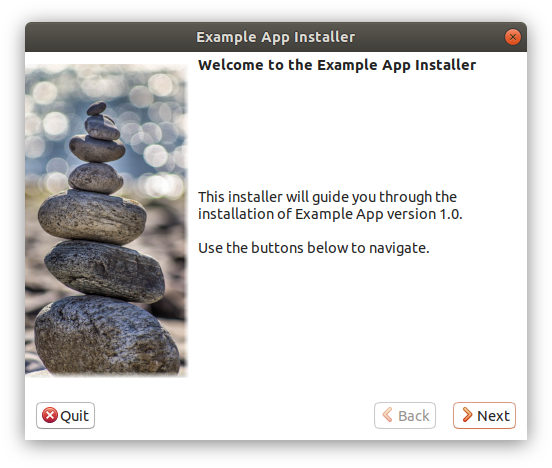

# Linux Installer

[](https://pkg.go.dev/github.com/grandchild/linux_installer)
[](
https://creativecommons.org/publicdomain/zero/1.0/)

Linux GUI installer for audiences that are used to Windows installers. When all you
would _really_ need is `unzip`, but want a nice user experience nonetheless. Imitates
the look and feel of [NSIS](https://nsis.sourceforge.io/Screenshots), or rather
[Wizard97](https://docs.microsoft.com/en-us/windows/win32/controls/wizards)-type
installers.



<sub><sub>
(Example installer [splash image](https://unsplash.com/photos/t1XLQvDqt_4) by
[_Deniz Altindas_](https://unsplash.com/@omeganova) and
[banner image](https://unsplash.com/photos/_TqnKtKCb5w) by
[_Victoria_](https://unsplash.com/@pixeldebris) via [unsplash.com](unsplash.com))
</sub></sub>

## Features

* Application menu entry creation (_.desktop_-files)
* Pre-/post-install script hooks
* Automatic uninstaller creation
* Commandline or *"silent"* mode
* Cancel with full rollback during install process
* Run application after finish

## Contents

* [Quickstart: Run the Example-Installer](#quickstart-run-the-example-installer)
* [Setup & Build a Linux Installer](#setup--build-a-linux-installer)
  * [Overview](#overview)
  * [Requirements](#requirements)
  * [Setup](#setup)
  * [Build](#build)
* [Customization](#customization)
  * [Images](#images)
  * [Installer Style & Layout](#installer-style-layout)
    * [GUI CSS](#gui-css)
  * [Hooks](#hooks)
  * [New Language Translation](#new-language-translation)
  * [New Installer Screens](#new-installer-screens)
    * [Layout](#layout)
    * [Behavior](#behavior)
* [Hacking](#hacking)
* [Troubleshooting](#troubleshooting)
* [License and Acknowledgments](#license-and-acknowledgments)

## Quickstart: Run the Example-Installer

If you have [all required packages](#requirements) installed, go to the repository
folder and do the following to run the example installer:

```shell
# Create source files folder
mkdir data

# Add a file of random 50MiB
dd if=/dev/urandom of=data/blob.data bs=1M count=50
# (Use the above, or copy some other files you want to try out. Add a lot of files
# if you want to look at the progress, the installer is quite fast!)

# Create and run the example installer
make run

# (The GTK Go-wrapper will take a while to build on the first run. Grab a coffee...)
```

## Setup & Build a Linux Installer

### Overview

This project creates an _installer builder_, which is used to create the actual
installers. The installer builder comes in the shape of a zip archive containing:

 - an empty `data/` source folder for your files
 - the naked `linux_installer` binary
   - _"naked"_ means "only the installer logic", your payload(s) will be appended to
     this file later to create the full installer.
 - all installer GUI files in `resources/` — to customize and modify
 - a `Makefile`/`make.bat` (for building on Linux/Windows respectively) to put
   it all together

The installer builder has no external dependencies (except for `make` on Linux, and
`Powershell` on Windows), and can be run on a minimal dedicated build machine.

### Requirements

* The following dependencies need to be installed to build:

  `go` `gcc` `gtk3` `make` `pkg-config` `zip`

  <sup>(Technically, BSD-Make works just as well as GNU-Make, so if you have `bmake`
  that'll work too).</sup>

  Prepared install commands for popular distributions are below:

  <details><summary><em>Archlinux / Manjaro</em></summary>

    `sudo pacman -S --needed go gcc gtk3 make pkg-config zip`
  </details>

  <details><summary><em>Debian / Ubuntu</em></summary>

    `sudo apt install golang-go gcc libgtk-3-dev libglib2.0-dev make pkg-config zip`
  </details>

  <details><summary><em>Gentoo</em></summary>

    `sudo emerge dev-lang/go x11-libs/gtk+:3 dev-libs/glib dev-util/pkgconfig app-arch/zip`
  </details>

  <details><summary><em>Fedora / RedHat</em></summary>

    `sudo dnf install golang gcc gtk3-devel make pkgconf zip`
  </details>

* If you're new to Go, verify that your installation works by running `go version`. It
  should print the installed Go version.

* If you want to edit the installer GUI layout you should install
  [Glade](https://glade.gnome.org/) as well.

### Setup

These steps need to be executed only initially and after updating the installer builder
itself.

1. [Install all dependencies](#requirements).
1. `cd` into the local copy of this repository and run `make linux-builder.zip`.
1. Copy the resulting `linux-builder.zip` archive to builder machine (if different). The
   builder machine can run Linux or Windows.
1. Extract anywhere.

### Build

These steps need to be executed in the extracted builder directory, and for every
installer.

1. Add necessary application files to the `data` subfolder
1. Set `variables.version` (and possibly other variables) in
   `resources`/`config.yml`
1. Run `make` to create installer.
   ```shell
   cd ~/path/to/linux-builder
   make
   # or set version and filename directly on the commandline:
   make VERSION=10.0 OUTPUT=Setup_ExampleApp_v1.1
   ```
1. The same on Windows:
   ```cmd
   cd /d D:\Data\linux-builder\
   make.bat
   :: or:
   make.bat VERSION=10.0 OUTPUT=Setup_ExampleApp_v1.1
   ```
   If you set the variables in `resources`/`config.yml` before you can also
   simply run `make.bat` by double-clicking.

#### Speed-Up Installer Creation

You can pre-compress files that are the same for several installers into zip archives
and put them into the `data_compressed` folder. This can speed up the creation of a
batch of mostly-similar installers.

*Note:* The archive name `data.zip` is used by the builder, so don't use that specific
filename.


## Customization

Various parts of the installer can be customized and changed without touching the code,
such as the style and layout of elements, and the translation strings. The way to do
this is described in this section.

Adding a new screen (or removing one) requires only minor code changes, and is explained
below as well.


### Images

The `splash.bmp` image is shown on the left-hand side of the language-, welcome- and
success-/failure screens, and needs to be a vertical 164×314 pixels in size. The *right
side* of the image should connect well with the `window.background` color (currently
plain white `#ffffff`).

The `banner.bmp` image is shown on the top of all other screens and needs to be a
horizontal 497×60 pixels in size. The *bottom* of the image should connect well with the
`window.background` color like above.

The `icon.gif` image is used as the icon in the taskbar and possibly the window's title
bar while the installer is running. It should be a square GIF image, not too large
(16×16 or 32×32 pixels).


### Installer Style & Layout

The GUI layout of the installer is specified in `resources/gui/gui.glade`. This file can
be edited with [Glade](https://glade.gnome.org/), a WYSIWYG GTK3 UI editor.

The layout consists of the main installer window and a do-you-really-want-to-quit dialog
box.

The installer window consists mainly of the "Stack" of screens that the installer can go
through. Not all have to be visited (e.g. installation failure), and not necessarily in
order (although they are mostly run through sequentially).

#### GUI CSS

GTK3 supports styling UI elements with CSS. Elements can have *id*s, *class*es and are
of a type, just like regular HTML elements.

The GUI CSS is loaded from a variable in `resources/config.yml` called `gui_css`, which
controls some colors in the GUI, and mostly sets the background color to white, and
changes some font properties so the license text is not too large, and the filenames in
the installer progress not too prominent.

To change the styling of the installer, simply change the content of that variable.


### Hooks

Before installation starts, and after, there is the possibility of running a custom
script to do any tasks necessary at that time. Currently these are present, but empty.

The hook scripts live in `resources/hooks/` and are named after their execution time,
namely `pre-install.sh` and `post-install.sh`, which run before and after installation,
respectively.

You can write custom commands into these files and they will be executed. Their output
(for debugging purposes) is logged into the installer.log file that is created when the
installer is run.


### New Language Translation

In short: Add a new file named `xx.yml` inside `resources/languages/` (or better, copy
`en.yml`), where "*xx*" is the language's two-letter [ISO
639-1](https://en.wikipedia.org/wiki/List_of_ISO_639-1_codes) code. Then translate all
messages. The language should now be available in the language selection in the GUI and
the help text in the CLI mode.

E.g. in order to add French, create and translate `resources/languages/fr.yml`.


### New Installer Screens

A new installer screen is a two-step process:

1. *Layout*: Create a new installer screen in `resources/gui/gui.glade`
1. *Behavior*: Add screen to `screenHandlers()` inside `gui/gui.go`

#### Layout

In the list of screens in Glade, right-click on the screen after which you want to
insert your new screen, and select "*Insert Page After*" at the bottom of the context
menu. Double-click inside the resulting empty space and select GtkBox to create a layout
base for the new screen. Give the Box an ID in the details panel on the right in the
"General" tab. This ID is needed in the next step.

You can then design the inside of the Box however you like. Remember to add IDs to
relevant elements in order to reach them from the behavior code.

#### Behavior

In `gui/gui.go` inside `screenHandlers()` add a new section for the screen like this:

```go
    {
        name: "myscreen",
        before: func() {
            // ...
        },
        after: func() {
            // ...
        },
        undo: func() bool {
            // ...
        }
    },
```

The "*name*" key is the ID you chose in the layout step. The "*before*", "*after*" and
"*undo*" keys are documented in the documentation for the ScreenHandler struct a little
bit earlier in `gui/gui.go`. Refer to that for details.

If a function for a key is empty, the key can be omitted completely.


## Hacking

See [HACKING.md](HACKING.md).


## Troubleshooting

#### `libc.so.6: version GLIBC_... not found`

The installer might fail to run on another machine with an error like this:

```
./linux_installer_dev: /lib/x86_64-linux-gnu/libc.so.6: version `GLIBC_2.32' not found (required by ./linux_installer_dev)
```

The installer builder was linked on a machine with a newer libc than the one on the
running system. The solution is to build on a system with the lowest libc version that
you want to target. Generally this means to build the installer builder on the oldest
Linux version that you are targeting.

To check which version you are running, run `ldd --version`.

(Note that this does not affect the machine on which you are packaging the actual
installers. You can run the installer builder on any system.)

#### make-run error `cp: cannot stat .../windows_amd64/rice.exe`

```
cp: cannot stat '~/go/bin/windows_amd64/rice.exe': No such file or directory
make: *** [Makefile:75: rice_bin] Error 1
```

This is quite a weird bug, that only happens the first time `make run` is invoked.
The solution is to call `make run` again. It will work this time.


## License and Acknowledgments

This software has a [CC0](https://creativecommons.org/publicdomain/zero/1.0/) license.

To the extent possible under law, all copyright and related or neighboring rights to
this work are waived.

(And yes, this means commercial use is explicitly allowed.)


This software was developed and tested for years at
[Contecs engineering services GmbH](http://www.contecs-engineering.de/) who have
graciously allowed publication as free and open source software. Thank you very much!
